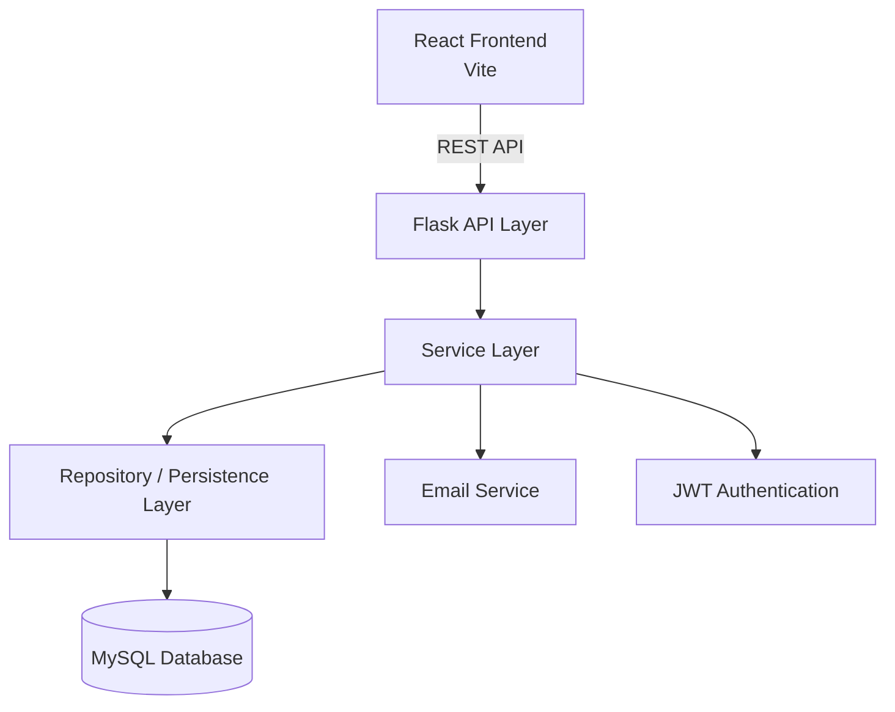
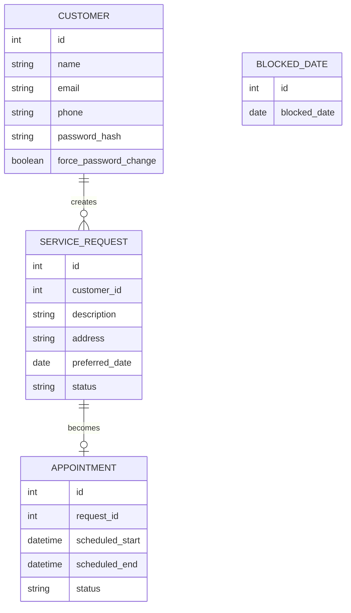

# JR Jardinage

## Professional Gardening Service Management Platform

JR Jardinage is a full-stack web application designed to manage gardening service requests, appointment scheduling, and customer administration for a local gardening business.

The platform replaces a basic time-slot booking system with a professional request-based scheduling workflow, reflecting how real gardening companies operate.

---

## Project Overview

JR Jardinage allows:

- Customers to request gardening services
- Admin to review and schedule appointments
- Full calendar management
- Multi-day scheduling
- Conflict detection with warning system
- Customer account management with temporary passwords
- Controlled appointment lifecycle

This system models real-world service business logic instead of simple slot booking.

---

## Architecture

The application follows a layered architecture that separates responsibilities between the API layer, business logic, and data access.

### Backend (Flask)

The backend is organized into structured layers inside the `backend/app` directory:

- **API Layer (`api/v1`)** – Handles HTTP requests and responses. These route files expose the REST API endpoints used by the frontend.
- **Service Layer (`services`)** – Contains the core business logic such as authentication, appointment scheduling, validation rules, and email notifications.
- **Models (`models`)** – SQLAlchemy ORM models representing database entities such as customers, appointments, and service requests.
- **Utilities (`utils`)** – Helper utilities including JWT token generation, password handling, and email sending.
- **Persistence / Repository Layer (`persistence`)** – Responsible for database interactions and abstraction of data access.

This layered design keeps the application maintainable and prevents business logic from being mixed with route handlers.

### Frontend (React + Vite)

The frontend is structured using a component‑based architecture:

- **Pages (`src/pages`)** – Main application screens such as Login, AdminDashboard, Calendar, and Booking.
- **Components (`src/components`)** – Reusable UI elements such as alerts and shared interface components.
- **Gallery (`src/gallery`)** – Static media assets used in the interface.
- **Styles (`src/styles`)** – CSS styling separated from React components.

The frontend communicates with the backend through REST API calls and manages application state to control navigation and workflow.

This separation between frontend UI and backend services improves scalability and code readability.

### Architecture Diagram



---

## Technologies Used


### Backend

- Flask (Python)
- SQLAlchemy
- MySQL
- Flask-CORS
- JWT Authentication
- Werkzeug (password hashing)
- Flask-Mail (email notifications)

### Frontend

- React (Vite)
- React Big Calendar
- date-fns
- Drag & Drop Calendar Addon

### Database

- MySQL

### Database Diagram



---

## Run With Docker

You can run the full stack with Docker Compose:

```bash
cp .env.docker.example .env
docker compose up --build
```

Then open:

```text
Frontend: http://localhost:5173
Backend:  http://localhost:5000
MySQL:    localhost:3307
```

The Docker setup starts:

- `db` - MySQL 8.4 with a persistent `mysql_data` volume
- `backend` - Flask API on port `5000`
- `frontend` - Vite React app on port `5173`

For local Docker development, the backend uses this internal database URL:

```text
mysql+pymysql://jardinage:password123@db:3306/jardinage_db
```

To stop the stack:

```bash
docker compose down
```

To also delete the MySQL Docker volume and reset the database:

```bash
docker compose down -v
```

---

## Authentication System

### Customer Authentication

- Email + Password
- Passwords hashed using `generate_password_hash`
- Temporary password system for admin-created accounts
- Forced password change on first login
- Password reset functionality via email token
- JWT-based authentication

### Admin Authentication

- Seeded admin account
- JWT role-based authentication

---

## Booking System Redesign

### Original Model

Customers could:

- Book exact time slots
- Overbook days
- Ignore job duration
- Create scheduling conflicts

This model did not reflect real gardening operations.

---

### Current Model – Request-Based Scheduling

#### Customer Workflow

1. Submit service request
2. Choose preferred date
3. Provide address and description
4. Status = `"pending"`

#### Admin Workflow

1. Review request
2. Estimate job duration
3. Assign start & end datetime
4. Status = `"scheduled"`
5. Appointment appears on calendar

---

### Appointment Lifecycle

| Status     | Meaning                  |
|------------|--------------------------|
| pending    | Waiting for admin review |
| scheduled  | Confirmed appointment    |
| cancelled  | Cancelled by admin       |
| completed  | (Future upgrade)         |

This introduces structured state management instead of simple CRUD operations.

---

## Calendar Features

- Drag & Drop appointment rescheduling
- Multi-day appointments supported
- Blocked dates (admin-controlled)
- Conflict warning (not forced blocking)
- Double-booking allowed with confirmation
- Appointment cancellation via modal
- Visual conflict indicators

---

## Project Structure

```
JR_Jardinage/
│
├── backend/
│   ├── routes/
│   │   ├── admin_routes.py
│   │   ├── appointment_routes.py
│   │   ├── customer_routes.py
│   │   └── service_request_routes.py
│   │
│   ├── services/
│   │   ├── admin_service.py
│   │   ├── appointment_service.py
│   │   └── customer_service.py
│   │
│   ├── repositories/
│   │   ├── admin_repository.py
│   │   ├── appointment_repository.py
│   │   └── customer_repository.py
│   │
│   ├── models.py
│   ├── app.py
│   └── config.py
│
├── frontend/
│   ├── src/
│   │   ├── pages/
│   │   │   ├── AdminDashboard.jsx
│   │   │   ├── AdminCalendar.jsx
│   │   │   ├── Account.jsx
│   │   │   ├── Booking.jsx
│   │   │   ├── Login.jsx
│   │   │   ├── Signup.jsx
│   │   │   ├── ResetPassword.jsx
│   │   │   ├── RequestReset.jsx
│   │   │   ├── ChangePassword.jsx
│   │   │   └── Home.jsx
│   │   ├── gallery/
│   │   ├── App.jsx
│   │   └── main.jsx
│   └── package.json
│
└── README.md
```

---

## Installation (Local Development)

### Backend Setup

```bash
cd backend
python3 -m venv venv
source venv/bin/activate   # Mac/Linux
# venv\Scripts\activate    # Windows
pip install -r requirements.txt
python3 app.py
```

**Server runs on:**
```
http://127.0.0.1:5000
```

---

### Frontend Setup

```bash
cd frontend
npm install
npm run dev
```

**Frontend runs on:**
```
http://localhost:5173
```

---

## Key Features

### Customer Portal

- Service request submission
- Appointment history view
- Account management
- Password change functionality
- Password reset via email

### Admin Dashboard

- Customer management (create, edit, delete)
- Service request review
- Appointment scheduling
- Interactive calendar with drag & drop
- Multi-day appointment support
- Conflict detection
- Temporary password generation and resend

### Security Features

- Password hashing with Werkzeug
- JWT authentication
- Secure password reset tokens
- Email verification for password reset
- Session management

---

## Key Engineering Decisions

**Separation of Concerns**  
Routes → Services → Repository layering

**State-Driven Workflow**  
Appointments controlled via lifecycle states

**Business-Realistic Model**  
Request-based instead of self-booked time slots

**Admin-Controlled Scheduling**  
Calendar reflects confirmed work only

**Security First**  
Password hashing and JWT authentication implemented early

---

## Future Improvements

- Automatic 24‑hour appointment reminder emails
- SMS reminders
- Invoice generation system
- Completed status tracking
- Enhanced customer dashboard
- Production deployment (Docker + Nginx)
- Role-based middleware protection
- Smart time-overlap conflict detection
- Advanced mobile UI optimization
- Payment integration
- Customer admin communication 

---

## System Evolution

The project evolved from:

**Basic slot booking**  
→ Duration-aware scheduling  
→ Request-based workflow  
→ Admin-controlled service management  
→ Multi-day calendar system  
→ Password reset functionality

This significantly improved:

- Architectural quality
- Business realism
- Scalability
- Code maintainability
- User experience

---

## Mobile Compatibility

The system is responsive and usable on mobile devices.  
Future iterations will include dedicated mobile UI optimization.

---

## Academic Context

This project demonstrates:

- Full-stack development
- Authentication systems
- Business workflow modeling
- Calendar integration
- State management
- Backend architecture layering
- Real-world problem solving
- Email integration
- Security best practices

---

## Author

**Omar Rouigui**  
Full Stack Development Student  
Holberton School

---

## Source Repository

The full project source code is available on GitHub:

https://github.com/omarrui/Jardinage_jr

The repository contains both the **frontend (React)** and **backend (Flask API)** code.  
Development was managed using **Git version control** with multiple branches for feature development, improvements, and fixes.

---

## Project Deliverables

Sprint Reviews  
doc/sprint_review.md

Retrospective  
doc/retrospective.md

Bug Tracking  
doc/bug-tracking.md

Testing Evidence and Results  
doc/results.md  
doc/results_postman/

Sprint Planning  
Project planning and sprint management were tracked using Trello:  
https://trello.com/invite/b/69787ac1c6b8b3f2e1919544/ATTI0c9de3400fc3577a98f7831a04f52cfeB03268D6/my-trello-board

Source Repository  
https://github.com/omarrui/Jardinage_jr

Production Environment

The system currently runs in a local development environment:

Backend (Flask API)  
http://127.0.0.1:5000

Frontend (React + Vite)  
http://localhost:5173

---

## License

This project is part of an academic portfolio.

---

## Contributing

This is an academic project, but feedback and suggestions are welcome!

---

**Last Updated:** March 2026
