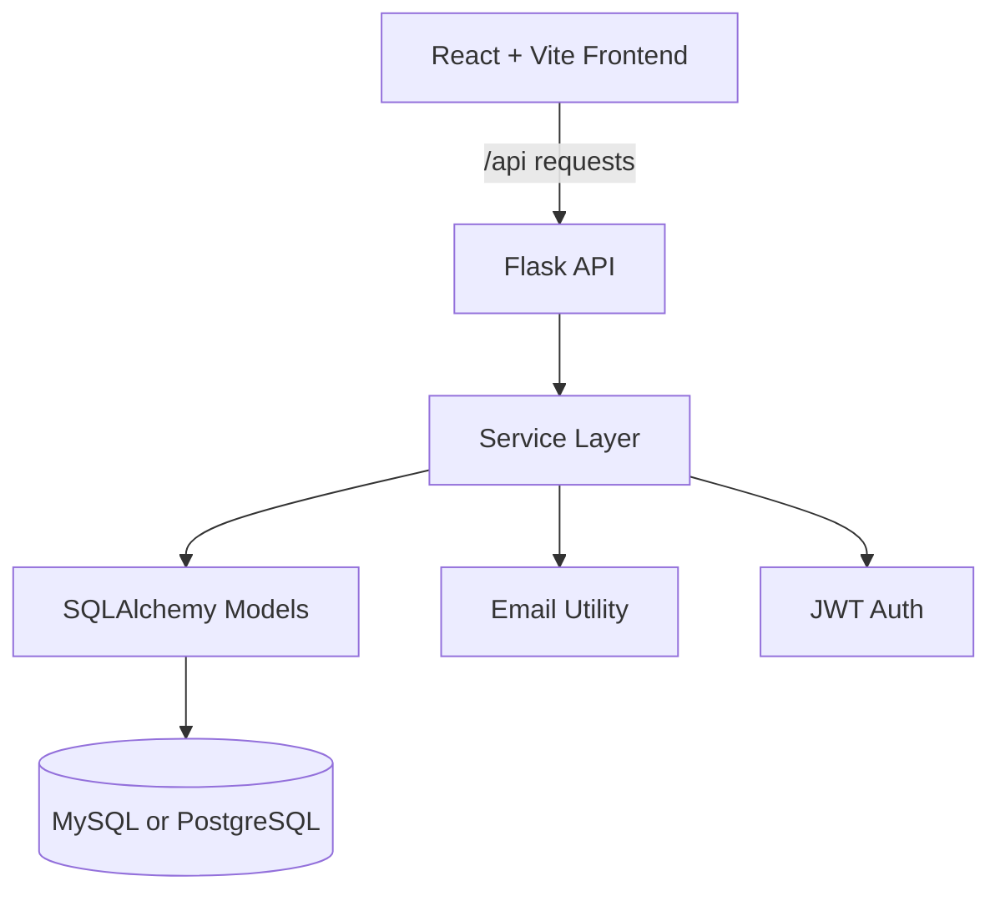

# JR Jardinage

JR Jardinage is a full-stack gardening service management platform for public quote requests, customer accounts, appointment scheduling, and admin calendar management.

The project uses a React/Vite frontend, a Flask API backend, SQLAlchemy, JWT authentication, email notifications, and a production database hosted outside the app.

---

## Main Features

- Public homepage for JR Jardinage services
- Public quote request form for non-active clients
- Customer signup and login
- Customer appointment requests
- Admin login
- Admin customer management
- Active and non-active client records
- Admin appointment calendar
- Click-to-create appointments from the admin calendar
- Block and unblock unavailable dates
- Email notifications for account creation, password reset, and public requests
- Responsive mobile navigation with burger menu
- PWA support through a web manifest and service worker

---

## Tech Stack

### Frontend

- React
- Vite
- React Big Calendar
- date-fns
- CSS modules/global CSS
- PWA manifest and service worker

### Backend

- Python
- Flask
- Flask-CORS
- Flask-SQLAlchemy
- SQLAlchemy
- PyJWT
- Werkzeug password hashing
- SMTP email sending

### Database

- MySQL for local Docker/local testing
- PostgreSQL/Supabase supported for production through `DATABASE_URL`

---

## Architecture



The backend is split into:

- `backend/app/api/v1` - route definitions
- `backend/app/services` - business logic
- `backend/app/models` - SQLAlchemy models
- `backend/app/persistence` - database access helpers
- `backend/app/utils` - JWT and email helpers

The frontend is split into:

- `frontend/src/pages` - main screens
- `frontend/src/components` - reusable UI pieces
- `frontend/src/api` - API URL and authenticated request helpers
- `frontend/public` - PWA assets

---

## Project Structure

```text
Jardinage_jr/
├── backend/
│   ├── api/
│   │   └── index.py
│   ├── app/
│   │   ├── api/v1/
│   │   ├── models/
│   │   ├── persistence/
│   │   ├── services/
│   │   └── utils/
│   ├── config.py
│   ├── run.py
│   ├── requirements.txt
│   └── vercel.json
├── frontend/
│   ├── public/
│   ├── src/
│   │   ├── api/
│   │   ├── components/
│   │   └── pages/
│   ├── package.json
│   └── vercel.json
├── docker/
├── docker-compose.yml
└── README.md
```

---

## Environment Variables

Never commit real secrets to GitHub. Keep them in `backend/.env` locally and in Vercel Environment Variables in production.

### Backend Required Variables

```env
SECRET_KEY=generate_a_long_random_secret
DATABASE_URL=your_database_connection_string
ADMIN_EMAIL=admin@example.com
ADMIN_PASSWORD=your_admin_password
FRONTEND_URL=https://your-production-frontend.vercel.app
```

### Backend Email Variables

```env
MAIL_USERNAME=your_gmail_address
MAIL_PASSWORD=your_gmail_app_password
MAIL_SERVER=smtp.gmail.com
MAIL_PORT=587
ADMIN_NOTIFICATION_EMAIL=where_public_form_notifications_go
```

### Optional CORS Variable

Use this if more than one frontend URL should be allowed:

```env
FRONTEND_ORIGINS=http://localhost:5173,https://your-production-frontend.vercel.app
```

### Sensitive Variables

Mark these as sensitive/secret in Vercel:

```env
SECRET_KEY
DATABASE_URL
ADMIN_PASSWORD
MAIL_PASSWORD
```

To generate a strong local secret:

```bash
openssl rand -hex 32
```

---

## Local Development

### Backend

```bash
cd backend
python3 -m venv .venv
source .venv/bin/activate
pip install -r requirements.txt
python run.py
```

Backend URL:

```text
http://127.0.0.1:5000
```

### Frontend

```bash
cd frontend
npm install
npm run dev
```

Frontend URL:

```text
http://localhost:5173
```

In development, the frontend uses:

```text
http://127.0.0.1:5000
```

unless `VITE_API_URL` is set.

---

## Run With Docker

From the project root:

```bash
docker compose up --build
```

Then open:

```text
http://localhost:5173
```

---

## Node.js Microservices Branch

The `nodejs-microservices` branch replaces the Flask backend container with a Node.js microservices setup:

- `api-gateway` keeps the same `/api/...` frontend contract on port `5000`
- `auth-service` owns login, signup, password reset, profiles, and admin customer management
- `appointment-service` owns requests, appointments, scheduling, cancellation, and blocked dates
- `notification-service` owns email delivery

See:

```text
node-services/README.md
```

```text
Frontend: http://localhost:5173
Backend:  http://localhost:5000
MySQL:    localhost:3307
```

To stop containers:

```bash
docker compose down
```

To remove the local Docker database volume too:

```bash
docker compose down -v
```

---

## Testing

### Backend Tests

From `backend/`:

```bash
python -m unittest tests/tests.py
```

The backend tests use the configured database connection, so local MySQL must be running if your test environment points to MySQL.

### Frontend Build

From `frontend/`:

```bash
npm run build
```

Vite may warn if the JavaScript bundle is larger than 500 kB. That warning does not mean the build failed.

---

## Deployment Notes

The project is deployed as two Vercel projects:

- Frontend: React/Vite app
- Backend: Flask API using `@vercel/python`

### Frontend API Routing

The frontend uses relative API routes in production:

```js
fetch("/api/...")
```

`frontend/vercel.json` rewrites those requests to the deployed Flask backend.

### Backend Routing

`backend/vercel.json` sends all backend requests to:

```text
backend/api/index.py
```

That file imports the Flask app from `backend/run.py`.

### Production Checklist

Before production deploy:

1. Push the correct branch, usually `main`.
2. Set backend environment variables in Vercel.
3. Make sure `FRONTEND_URL` matches the real production frontend URL.
4. Make sure frontend rewrites point to the real production backend URL.
5. Redeploy backend after changing env vars.
6. Redeploy frontend after changing frontend routing or build files.

---

## Security Notes

Recent security hardening added:

- Hardcoded email credentials were removed from the codebase.
- Email credentials now come from environment variables.
- `SECRET_KEY` is required and no longer falls back to a weak default.
- Admin API routes require a valid admin JWT.
- Frontend admin requests now send the stored admin token automatically.
- CORS allows local development and configured production frontend origins.
- OPTIONS preflight requests are handled for browser requests.

Important: if any secret was ever committed to GitHub, rotate it even after removing it from the current code because it may still exist in Git history.

Recommended future security improvements:

- Add rate limiting to login and password reset routes.
- Add admin two-factor authentication.
- Move auth tokens from `localStorage` to a more secure cookie-based setup.
- Add centralized request validation.
- Add automated secret scanning in GitHub.

---

## How The Latest Security Changes Were Made

The latest security pass changed both backend and frontend behavior without changing the normal user workflow.

### Email Secrets

Before, the Gmail sender address and app password were written directly in `email_utils.py`.

Now, the backend reads them from:

```env
MAIL_USERNAME
MAIL_PASSWORD
MAIL_SERVER
MAIL_PORT
```

The app also cleans spaces from Gmail app passwords, because Google often displays app passwords in grouped chunks.

### Flask Secret Key

Before, the backend could fall back to a simple development secret.

Now, `SECRET_KEY` is mandatory. If it is missing, the backend stops early so the mistake is obvious.

### Admin Route Protection

Admin endpoints now use a shared `require_admin` decorator. It checks:

- Is there an `Authorization` header?
- Is the JWT valid?
- Does the token role equal `admin`?

If not, the API returns `401` or `403`.

### Frontend Admin Requests

The frontend now has an `adminFetch()` helper. It wraps normal `fetch()` and automatically adds:

```http
Authorization: Bearer <token>
```

That keeps admin dashboard and calendar calls working with the new backend protection.

---

## Author

Omar Rouigui  
Full Stack Development Student  
Holberton School

---

## Repository

```text
https://github.com/omarrui/Jardinage_jr
```

---

## License

This project is part of an academic portfolio.

---

**Last Updated:** June 2026
