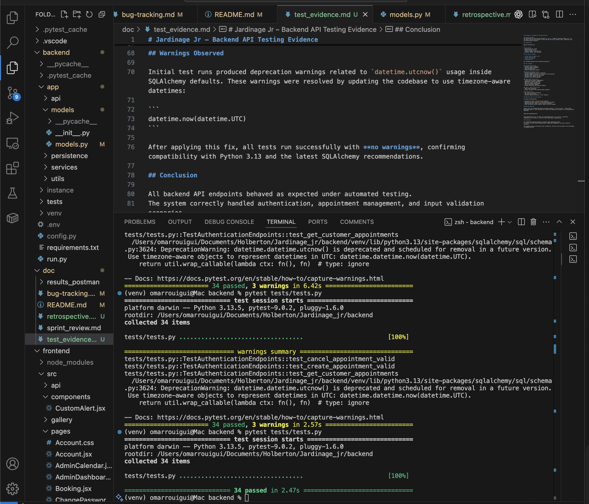
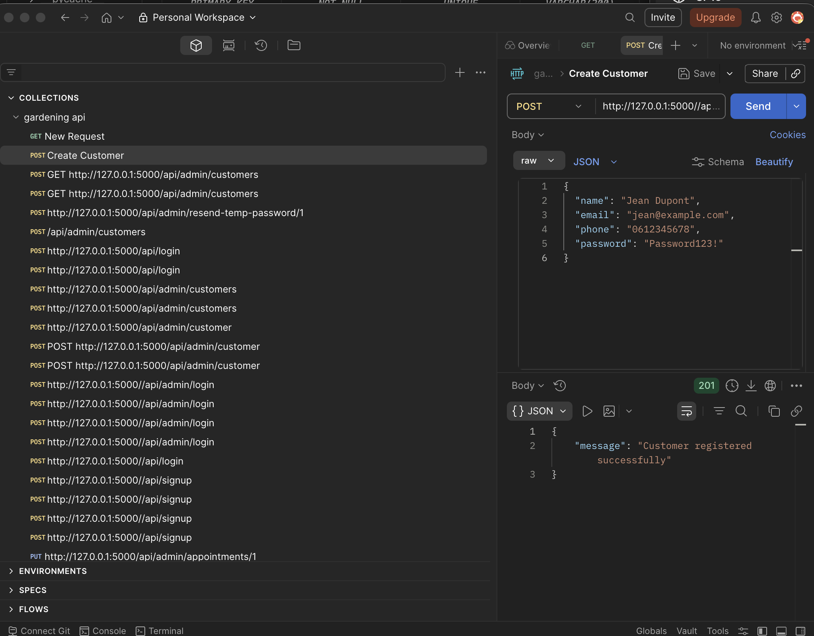
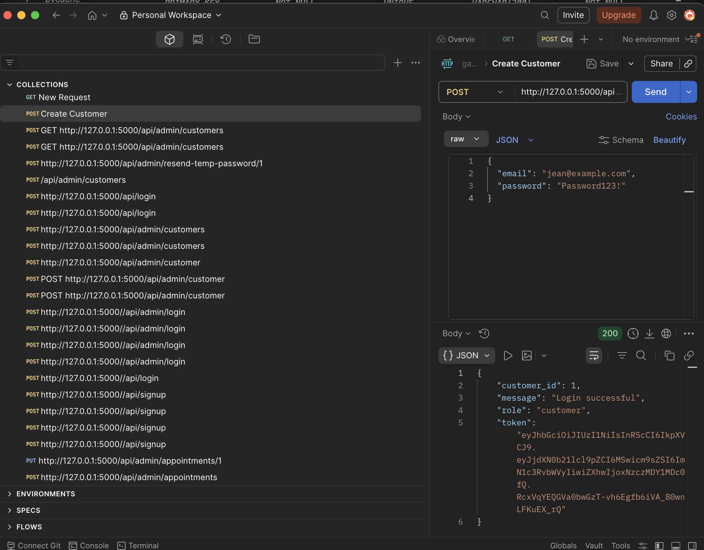
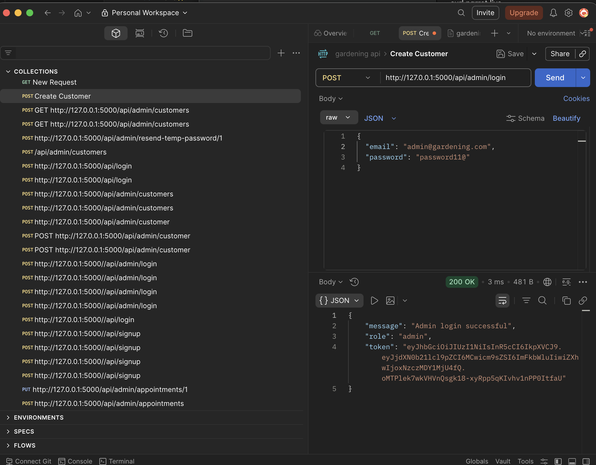
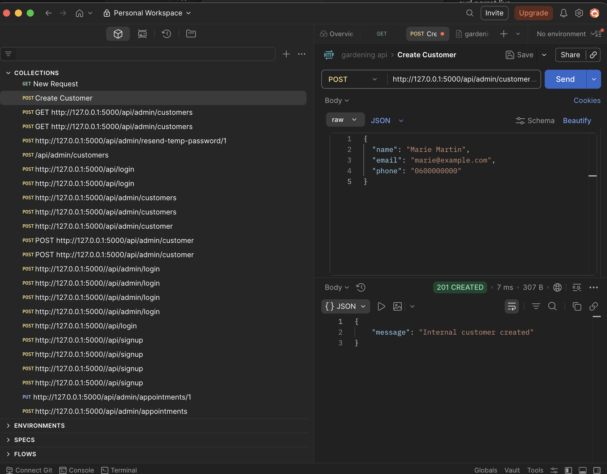
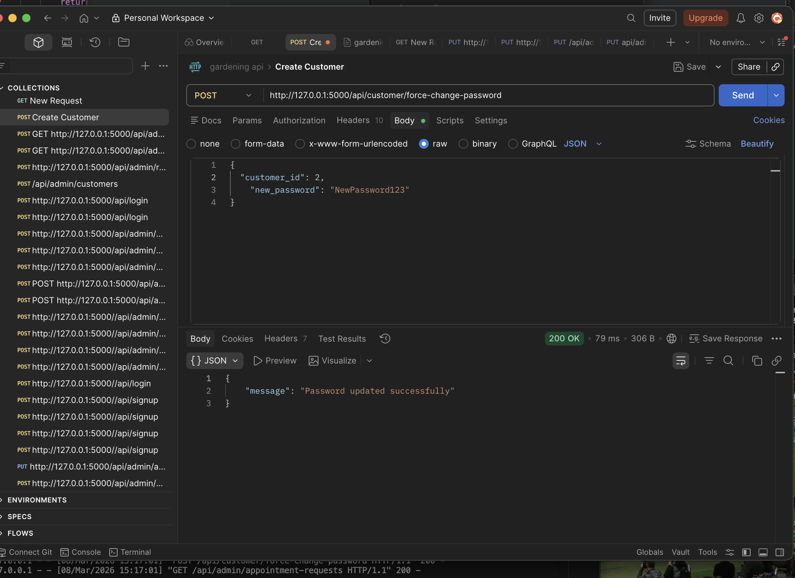
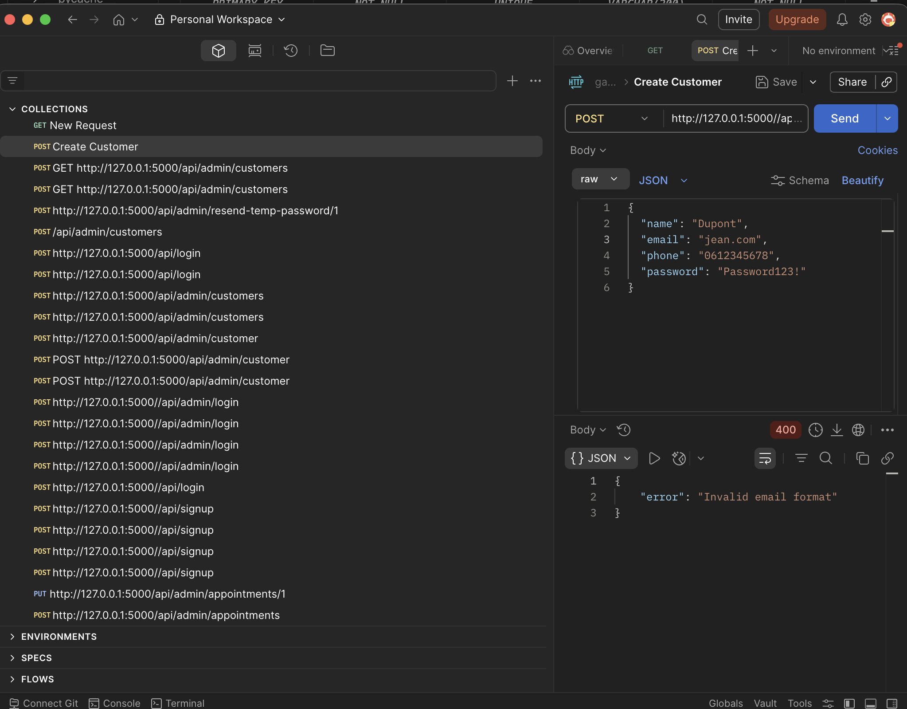
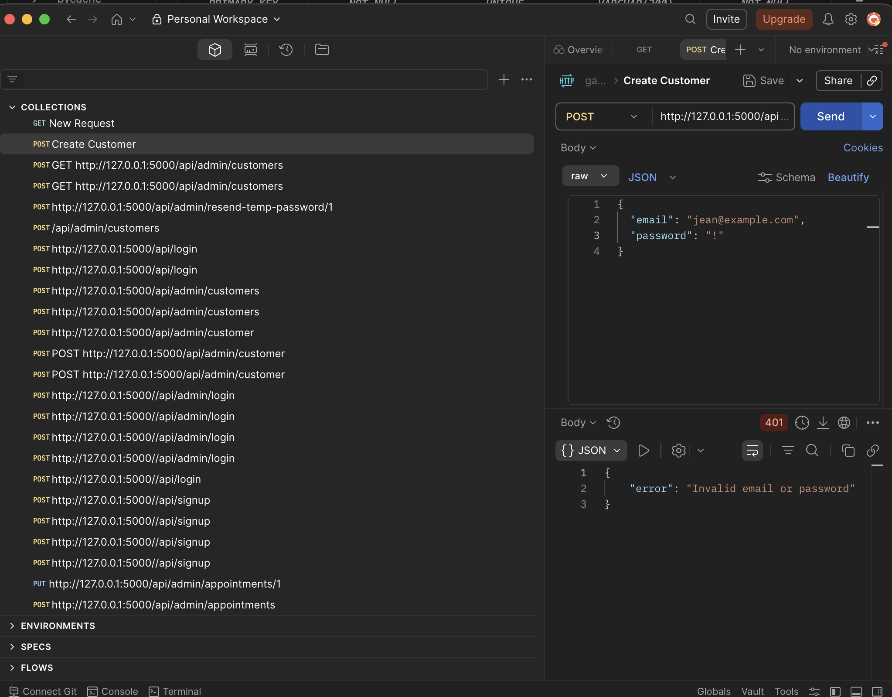
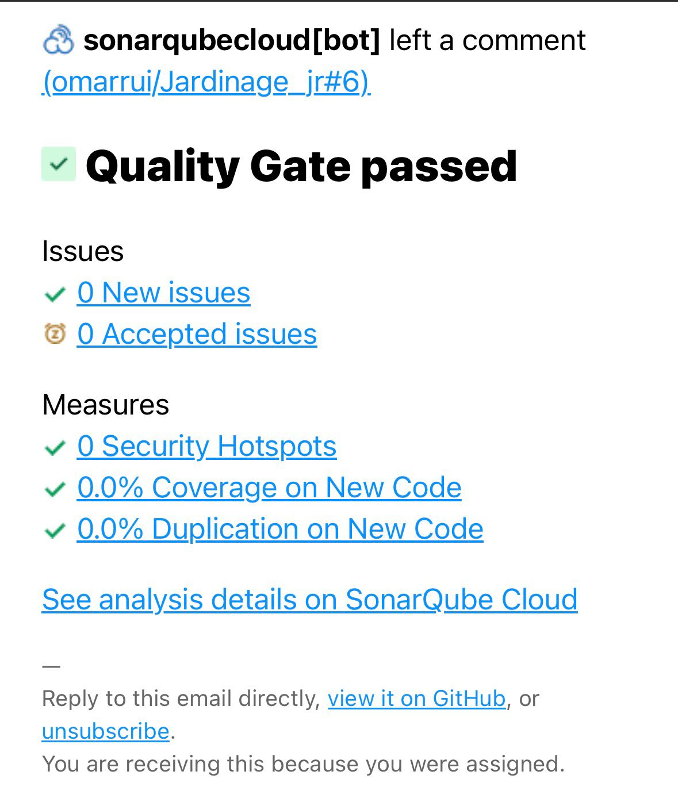

# Jardinage Jr – Backend API Testing Evidence

## Testing Framework
The backend API was tested using Python’s **unittest** framework executed through **pytest**.  
The tests simulate HTTP requests to the Flask API and verify response codes, validation rules, and authentication behavior.

## Command Used
```
pytest tests/tests.py
```

## Environment
- Operating System: macOS  
- Python Version: 3.13.5  
- Testing Framework: pytest 9.0.2  
- Database: SQLite (test database)

## Test Results Summary

- **Total Tests Executed:** 34  
- **Tests Passed:** 34  
- **Tests Failed:** 0  
- **Warnings:** 0  


All automated backend tests executed successfully.

### Pytest Execution Proof

The following screenshot shows the successful execution of the automated backend test suite where all tests passed.




---

## Manual API Testing Evidence (Postman)

In addition to automated pytest tests, the API endpoints were manually tested using **Postman** to verify real request/response behavior and validation scenarios.

Below are examples of successful and failed API calls captured during manual testing:

### Successful Requests

Customer Signup



Customer Login



Admin Login



Admin Creates Customer



Forced Password Change



### Validation & Error Handling Tests

Duplicate Email During Signup


Invalid Email Format



Invalid Login Attempt



These screenshots demonstrate that the API correctly handles both **successful operations** and **error validation scenarios**, confirming the reliability of authentication, account creation, and password management endpoints.

## Test Coverage

### Authentication Tests
- Customer signup validation  
- Duplicate email protection  
- Login authentication  
- Missing credentials handling  

### Password Management Tests
- Password change with correct credentials  
- Password change validation for incorrect current password  
- Missing fields during password change  
- Password reset request via email  
- Password reset code validation  

### Appointment System Tests
- Create service request (appointment)  
- Appointment creation validation  
- Handling invalid customer IDs  
- Retrieve customer appointments  
- Cancel appointment requests  
- Prevent cancelling non-existent requests  

### Admin & Authorization Tests
- Admin login validation  
- Prevent customers from accessing admin endpoints  

### Security Tests
- SQL injection attempt detection  
- XSS input sanitization  
- Password exposure prevention in API responses  

## Important Security Verification

The tests confirmed that:

- Passwords are never returned in API responses.  
- Duplicate accounts cannot be created using the same email.  
- Unauthorized users cannot access protected endpoints.  
- Input validation protects against common injection attempts.

## Static Code Analysis (SonarQube)

In addition to automated and manual testing, the project code was analyzed using **SonarQube Cloud** to verify code quality, security practices, and potential code issues.

The analysis confirmed that the project passed the **SonarQube Quality Gate**, meaning:

- No new code issues were detected
- No security hotspots were identified
- No duplicated code was introduced

This automated quality analysis provides an additional verification layer ensuring that the codebase follows good security and maintainability practices.

### SonarQube Analysis Proof



## Warnings Observed

Initial test runs produced deprecation warnings related to `datetime.utcnow()` usage inside SQLAlchemy defaults. These warnings were resolved by updating the codebase to use timezone-aware datetimes:

```
datetime.now(datetime.UTC)
```

After applying this fix, all tests run successfully with **no warnings**, confirming compatibility with Python 3.13 and the latest SQLAlchemy recommendations.

## Conclusion

All backend API endpoints behaved as expected under automated testing.  
The system correctly handled authentication, appointment management, and input validation scenarios.

The automated testing suite helps ensure reliability, security, and correctness of the Jardinage Jr backend services.
